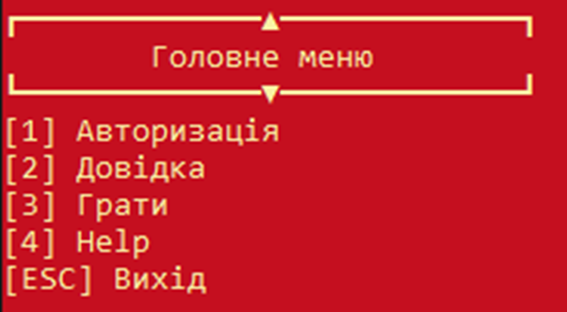
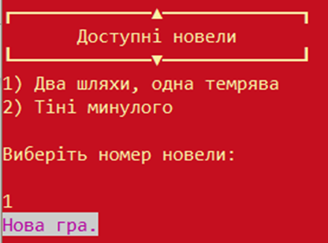
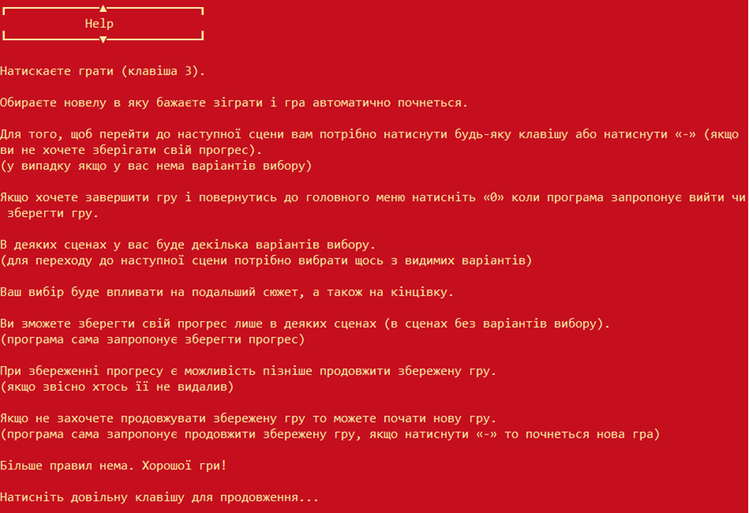
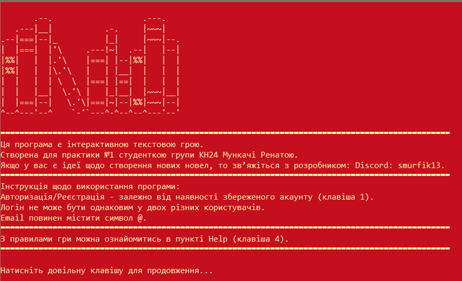
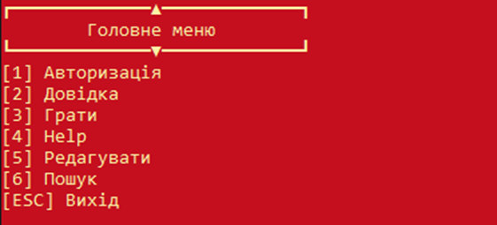
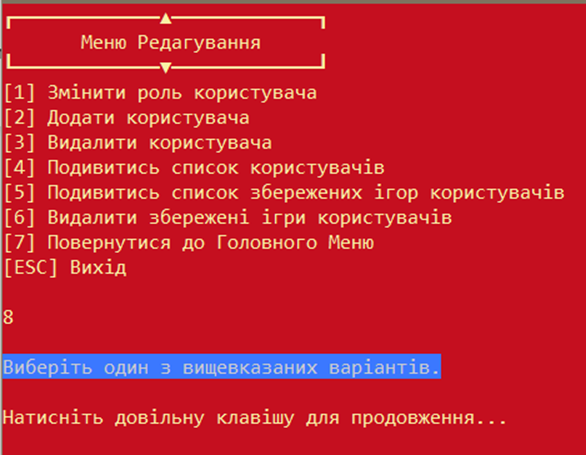
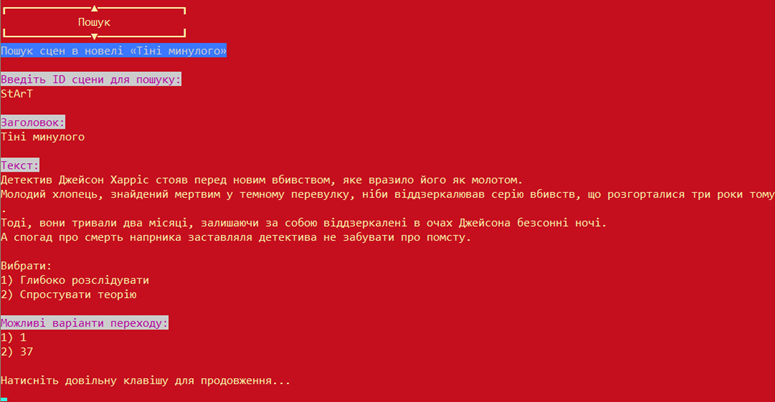

# 📖 Story Game — C# Console Interactive Novel

> 🇺🇦 **This application is available in Ukrainian only.**

A console-based interactive novel (visual novel) engine built with **C#** and **.NET** in Visual Studio. Players can read through branching stories loaded from plain text files, make choices that affect the narrative, and save their progress — all within a colorful terminal interface.

---

## ✨ Features

- **Story engine** — reads episodes from structured `.txt` files; supports branching choices and automatic scene transitions
- **User accounts** — register and log in with a username, password, and email; accounts persist between sessions
- **Save & resume** — save progress at any scene and continue later from where you left off
- **Multiple novels** — select from any novel placed in the `Novel/` folder
- **Admin panel** — privileged users can add/delete accounts, change roles, search scenes by ID, and view save data
- **Input validation** — handles incorrect logins, duplicate usernames, invalid emails, bad roles, and missing files gracefully

---

## 🛠️ Tech Stack

| Tool | Purpose |
|------|---------|
| C# / .NET Framework | Core language & runtime |
| Visual Studio 2022 Community | IDE |
| Plain `.txt` files | Data storage (users, saves, story episodes) |

---

## 📁 Project Structure

```
NP_InteractiveNovel/
├── Data/
│   ├── UserData/
│   │   ├── users.txt        # Registered accounts
│   │   ├── roles.txt        # Valid roles (user, admin)
│   │   └── userSaves.txt    # Saved game progress
│   ├── Novel/
│   │   └── <NovelName>/     # One folder per novel
│   │       ├── start.txt    # Entry point (required)
│   │       ├── 1.txt
│   │       ├── 2.txt
│   │       └── ...
│   ├── about.txt
│   └── help.txt
└── NP_InteractiveNovel.sln
```

---

## 📝 Episode File Format

Each scene is a `.txt` file named by its ID (the filename **is** the scene ID). It must follow this structure:

```
title:
Scene Title Here

body:
The story text goes here...

choice:
2;3;4
```

- **`choice:`** lists the IDs of the next scenes, separated by `;`
- A single ID = automatic transition; multiple IDs = player chooses
- **No `choice:` section** = end of the novel

---

## 🚀 Getting Started

1. Clone the repository
2. Open `NP_InteractiveNovel.sln` in Visual Studio 2022
3. Build and run the project (`F5`)
4. Register an account or log in, then pick a novel and start reading!

**To add your own novel:** create a folder inside `Data/Novel/` with your novel's name, add a `start.txt` file, and link scenes together using the episode format above.

---

## 👤 User Roles

| Role | Permissions |
|------|------------|
| `guest` | View help/about only |
| `user` | Play novels, save progress |
| `admin` | Everything + manage users, search scenes, edit roles |

---

## 🖼️ Screenshots

**Intro & Main Menu**




**Gameplay**




**Help & Info**




**Admin Features**





---

## 📌 Requirements

- Windows PC or laptop
- .NET Framework (compatible with Visual Studio 2022)
